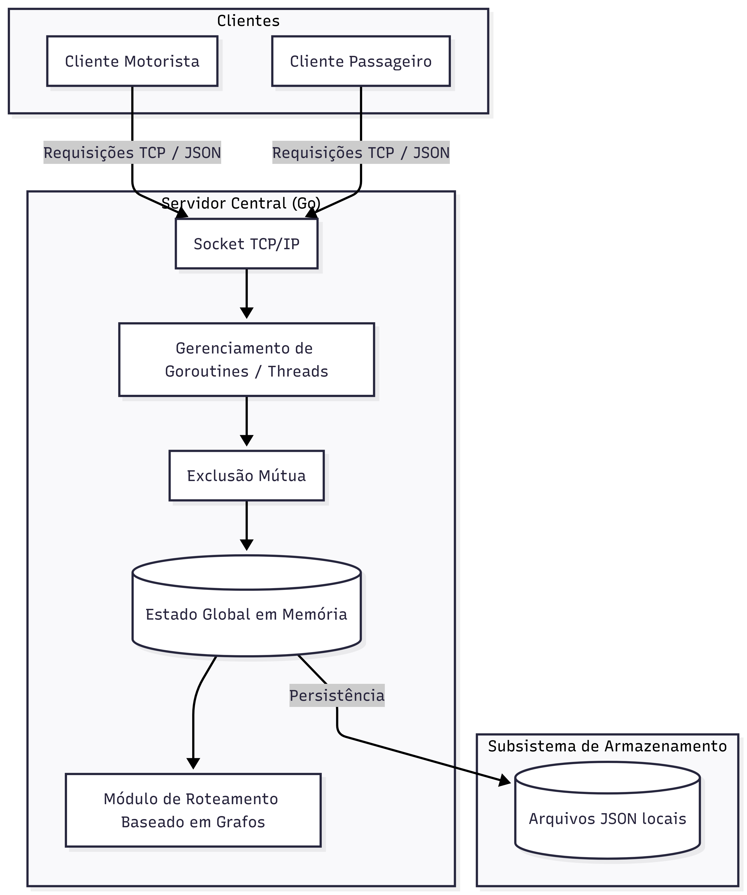
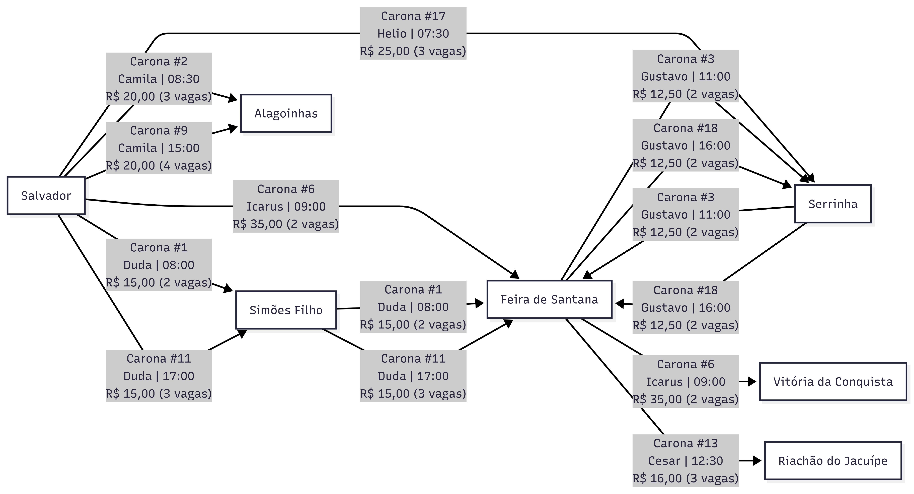

# VAIJUNTO - Sistema de Caronas Compartilhadas

> **TEC502 - TP02 - Concorrência e Conectividade - 2026.2 | UEFS**

## Sumário
1. [Visão Geral e Contexto Acadêmico](#visão-geral-e-contexto-acadêmico)
2. [Levantamento de Requisitos e Clientes](#levantamento-de-requisitos-e-clientes)
3. [Fundamentação Teórica](#fundamentação-teórica)
4. [Arquitetura do Sistema e Topologia](#arquitetura-do-sistema-e-topologia)
5. [Módulo de Roteamento e Composição de Trechos](#módulo-de-roteamento-e-composição-de-trechos)
6. [Especificação de Hardware e Software](#especificação-de-hardware-e-software)
7. [Instalação e Configuração](#instalação-e-configuração)
8. [Testes Automatizados e Confiabilidade](#testes-automatizados-e-confiabilidade)
9. [Equipe de Desenvolvimento](#equipe-de-desenvolvimento)

---

## Visão Geral e Contexto Acadêmico
O VAIJUNTO é um sistema distribuído de caronas compartilhadas para rotas intermunicipais e interestaduais, desenvolvido para otimizar assentos ociosos em veículos particulares de forma semelhante a plataformas como o BlaBlaCar. A solução foi concebida para atender ao Problema 1 da disciplina TEC502. Todo o ecossistema foi projetado para operar estritamente sobre a camada de transporte TCP/IP em Go (Golang), executando o backend em contêineres Docker para garantir a avaliação realista em computadores distintos.

## Levantamento de Requisitos e Clientes
O sistema gerencia viagens multitrecho de forma concorrente e segura, com a interface do usuário operada por clientes distintos com permissões rigorosas:
* **Cliente Motorista:** Permite a autenticação, a publicação de uma carona (definindo a sequência ordenada de cidades, data, horário, assentos livres e valor por trecho), a consulta das viagens já cadastradas e passageiros confirmados, além do cancelamento da carona oferecida.
* **Cliente Passageiro:** Responsável pela autenticação, pela busca de itinerários disponíveis, pela reserva atômica dos trechos (assegurando que ou todos os trechos do itinerário são confirmados, ou nenhum o é) e pelo cancelamento de suas próprias reservas.
* **Notificações e Cancelamento em Cascata:** Propagação automática de cancelamentos de viagens, invalidando reservas dependentes e alertando os passageiros afetados.

## Fundamentação Teórica
* **Enquadramento de Fluxo (Packet Framing):** O TCP é orientado a fluxo contínuo e não possui fronteiras de mensagens nativas. O sistema utiliza delimitação explícita por quebra de linha (`\n`) para reconstruir pacotes JSON exatos, mitigando a fragmentação e os efeitos do algoritmo de Nagle.
* **Teoria dos Grafos e Busca em Profundidade (DFS):** Teoria dos Grafos e Busca em Profundidade (DFS): O algoritmo de roteamento modela os trechos disponíveis como arestas dirigidas em um grafo. Um algoritmo DFS com poda temporal (backtracking e validação de horários de conexão) é utilizado para encontrar caminhos viáveis sem gerar loops infinitos.
* **Criptografia Determinística:** Implementação de hashing baseado em acúmulo polinomial quadrático sobre códigos ordinais, utilizando matemática de precisão arbitrária para garantir a integridade e segurança no armazenamento de senhas.

## Arquitetura do Sistema e Topologia
A arquitetura implementa um único servidor centralizado e dispensa integralmente o uso de frameworks de mensageria, chamada remota de procedimento (RPC) ou Sistemas Gerenciadores de Bancos de Dados (SGBDs) externos.



* **Comunicação Direta:** Os clientes (Cliente Motorista e Cliente Passageiro) enviam Requisições TCP / JSON diretamente ao Servidor Central (Go). Os dados trafegam através de um Socket TCP/IP utilizando uma representação intermediária bem definida para garantir a interoperabilidade entre as partes.
* **Controle de Concorrência e Sincronização:** O servidor delega as requisições ao bloco de Gerenciamento de Goroutines / Threads. A sincronização transacional para prevenir sobrevenda de vagas é garantida por Exclusão Mútua nativa (`sync.RWMutex`), protegendo o Estado Global em Memória em um protocolo de reserva de duas fases.
* **Rotas e Armazenamento:** A partir do estado em memória, a aplicação ramifica-se para o Módulo de Roteamento Baseado em Grafos e para o serviço de Persistência, que mantém os registros do sistema no Subsistema de Armazenamento através de Arquivos JSON locais.

``` text
├── aplicacao/
│   ├── motorista/main.go       # Cliente CLI interativo para Motoristas
│   ├── passageiro/main.go      # Cliente CLI interativo para Passageiros
│   └── servidor/main.go        # Ponto de entrada do Servidor Central TCP
├── Assets/
│   ├── Grafo.png               # Diagrama visual de rotas e grafos
│   └── TCP-IP.png              # Fluxograma de arquitetura e comunicação TCP/IP
├── comunicacao/
│   ├── conexao/tcp.go          # Abstração de transporte TCP
│   ├── protocolo/              # Contratos de mensagens (JSON)
│   │   ├── caronas.go          # Tipos e estruturas de caronas
│   │   ├── reservas.go         # Tipos e estruturas de reservas
│   │   └── usuarios.go         # Tipos e estruturas de usuários
│   └── visual/visual.go        # Formatação ANSI e cores para terminal
├── servicos/
│   ├── caronas/service.go      # Decomposição de rotas e módulo de roteamento DFS
│   ├── persistencia/           # Gerenciamento de persistência e segurança
│   │   ├── logger.go           # Logs estruturados de auditoria
│   │   └── servico.go          # Hashing determinístico de senhas
│   ├── reservas/service.go     # Transações de reserva e cancelamento em cascata
│   └── usuarios/service.go     # Autenticação e gestão de credenciais
├── tests/                      # Testes automatizados do sistema
│   ├── concorrencia_test.go    # Testes de estresse e atomicidade de concorrência
│   ├── helpers_test.go         # Funções auxiliares para testes
│   └── usuarios_test.go        # Testes de unicidade de perfis e usuários
├── docker-compose.yaml         # Orquestração dos contêineres Docker
├── Dockerfile                  # Empacotamento multi-stage
├── go.mod                      # Dependências e definição do módulo Go
├── LICENSE                     # Licença do software
├── Makefile                    # Automação de compilação, execução e testes
└── README.md                   # Documentação principal do projeto
```

## Módulo de Roteamento e Composição de Trechos
O VAIJUNTO controla a disponibilidade de assentos individualmente por trechos e não pela viagem inteira. O grafo lida com múltiplas possibilidades simultâneas. Por exemplo, diversos motoristas podem partir de Salvador rumo a cidades como Alagoinhas, Feira de Santana ou Simões Filho em horários variados (como 08:00, 09:00 ou 17:00), oferecendo diferentes combinações de preços e capacidades de vagas.



Se um passageiro deseja ir de Salvador a Vitória da Conquista, mas não encontra uma rota direta, o algoritmo realiza a busca em profundidade no grafo e possibilita a reserva de uma combinação de trechos com diferentes motoristas (ex: embarcar com o motorista "Duda" e fazer conexão no veículo de "Icarus"), desde que a baldeação seja temporalmente viável.

## Especificação de Hardware e Software

| Categoria | Especificação                                        |
| :--- |:-----------------------------------------------------|
| **Linguagem Base** | Go (Golang) 1.22 (Biblioteca Padrão)                 |
| **Protocolo de Rede** | Sockets via API nativa do `TCP/IP`                   |
| **Formato de Dados** | Representação intermediária estruturada (JSON)       |
| **Ambiente de Execução** | Contêineres Docker (Emulação em máquinas distintas)  |
| **Sistema Operacional (Container)** | Alpine Linux 3.20                                    |
| **Consumo de Memória (Servidor)** | ~2 KB de stack inicial por conexão ativa (Goroutine) |
| **Tamanho da Imagem Compilada** | ~15 MB (Binários estáticos)                          |

## Instalação e Configuração
O sistema está configurado para fácil compilação e execução através de um utilitário `Makefile`, dispensando a instalação local de *toolchains* do Go caso você opte por utilizar o ambiente Docker.

Aqui estão as instruções completas de execução divididas exatamente nas duas abordagens: utilizando puramente comandos `docker compose run` (ou `docker-compose`) e utilizando os atalhos do utilitário `Makefile`.

---

### Opção 1: Execução Exclusiva com Docker Compose

Esta opção utiliza os comandos diretos do Docker para instanciar e interagir com os contêineres do sistema (servidor e clientes).

1. **Clonar o repositório:**
```bash
git clone https://github.com/Dudateic/Sistema-Caronas-Compartilhadas.git
cd Sistema-Caronas-Compartilhadas
```

2. **Subir o Servidor Central:**
   Para inicializar o servidor em segundo plano e expor a porta TCP 8081:
```bash
docker compose up --build -d
```
*(Nota: Se a sua versão do Docker for mais antiga, utilize `docker-compose up --build -d`)*

3. **Executar o Cliente Motorista via Docker:**
   Para rodar a interface interativa do motorista conectada à rede dos contêineres:
```bash
docker compose run --rm vaijunto_motorista
```

4. **Executar o Cliente Passageiro via Docker:**
   Para rodar a interface interativa do passageiro:
```bash
docker compose run --rm vaijunto_passageiro
```

5. **Derrubar e limpar o ambiente Docker:**
```bash
docker compose down
```

---

### Opção 2: Execução Exclusiva com Makefile (Ambiente Local Go)

Caso prefira compilar e rodar os binários diretamente na máquina local utilizando o `Makefile` configurado no repositório:

1. **Clonar o repositório:**
```bash
git clone https://github.com/Dudateic/Sistema-Caronas-Compartilhadas.git
cd Sistema-Caronas-Compartilhadas
```

2. **Compilar todos os aplicativos:**
   Gera os binários executáveis na pasta `bin/`:
```bash
make build
```

3. **Iniciar o Servidor Central:**
```bash
make run-servidor
```

4. **Iniciar o Cliente Motorista:**
```bash
make run-motorista
```

5. **Iniciar o Cliente Passageiro:**
```bash
make run-passageiro
```

6. **Utilitários adicionais do Makefile:**
* **Executar os testes automatizados:**
```bash
make run-testes
```

* **Limpar arquivos de dados (JSON) e logs:**
```bash
make clean-data
```

* **Remover os binários compilados:**
```bash
make clean
```

## Testes Automatizados e Confiabilidade
O pacote de software conta com rotinas de testes automatizados (`tests/`) focadas no comportamento do sistema sob alta carga. Estes testes submetem o servidor central a requisições de múltiplos clientes simultâneos que disputam os mesmos trechos e vagas. As avaliações automáticas asseguram que:
* **Prevenção de Condições de Corrida:** Nenhum assento de um mesmo trecho seja vendido duas vezes para passageiros distintos. Submetendo uma carona de 2 vagas a 10 requisições simultâneas, o log de auditoria garante exatamente 2 reservas processadas e 8 recusas, mantendo a atomicidade do protocolo de duas fases.
* **Integridade Relacional:** A remoção de uma viagem pelo motorista limpa instantaneamente todas as reservas associadas da memória e enfileira os alertas atômicos para as caixas de notificação dos passageiros. Nenhum itinerário sofre confirmação parcial e nenhum assento fica permanentemente bloqueado por transações incompletas.
* **Disponibilidade:** O tempo de resposta permanece aceitável e o servidor suporta a queda abrupta de um cliente sem interromper a disponibilidade do sistema nem corromper o estado das reservas.

## Equipe de Desenvolvimento
O presente projeto foi desenvolvido por Maria Eduarda Teixeira Costa (GitHub: Dudateic)
